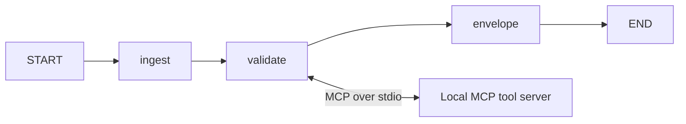

# Toy LangGraph + MCP lab

This lab takes a synthetic national ID, checks its format through a real local
MCP tool server, and creates a versioned message describing the result.
No LLM, API key, database, or internet connection is needed at runtime.

## Run on Windows (PowerShell)

Use Python 3.11 or newer. This folder already contains a `.venv`.
For a fresh checkout, create one first with `py -m venv .venv`.

```powershell
.\.venv\Scripts\python.exe -m pip install -r requirements.txt
.\.venv\Scripts\python.exe main.py
.\.venv\Scripts\python.exe main.py 123
.\.venv\Scripts\python.exe -m unittest -v
```

The connector starts and stops `mcp_server.py` automatically. You do not need
to launch the server yourself. Dependencies are pinned to the versions used
for this lab; MCP 1.x has different APIs.

## Follow one request



1. `main.py` supplies `{"national_id": "12345678901234"}` to the compiled graph.
2. `ingest_node` requires a string and removes surrounding whitespace.
3. `validate_node` awaits the connector. The connector launches the server
   using the same Python interpreter, connects using the MCP SDK, and calls
   `validate_national_id` with a named arguments object.
4. The server invokes `NationalIDTool.validate`, then sends a structured result
   back through MCP. The connector checks for tool errors; the node checks that
   the result has an expected status and refers to the requested ID.
5. The node returns `{"validation_result": ...}`. LangGraph merges this update
   into shared state; nodes only need to return fields they change.
6. `envelope_node` adds routing metadata and a reference to that result.
7. `main.py` prints the final state as JSON.

The successful result contains:

```json
{
  "national_id": "12345678901234",
  "validation_result": {
    "status": "valid",
    "national_id": "12345678901234"
  },
  "envelope": {
    "sender_agent_id": "national-id-agent",
    "receiver_agent_id": "result-consumer",
    "task": "validate_national_id",
    "artifact_refs": ["validation_result"],
    "trust_context": {
      "source": "mcp",
      "tool": "validate_national_id",
      "transport": "stdio",
      "validation_scope": "format_only"
    },
    "protocol_version": "1.0"
  }
}
```

## What the files do

| File | Responsibility |
| --- | --- |
| `state.py` | Shared state shape; output fields are optional before their nodes run. |
| `graph.py` | Nodes, execution order, and graph compilation. |
| `nodes.py` | Input handling, tool call, and envelope construction. |
| `mcp_tool.py` | Toy validation logic and the actual MCP client connector. |
| `mcp_server.py` | Registers the function as an MCP tool and serves it over stdio. |
| `Message_envelope.py` | Application message schema, validation, and dictionary conversion. |
| `main.py` | Script and async entry points. |
| `test_pipeline.py` | Format, envelope, real MCP integration, and failure tests. |

## Why a versioned envelope?

An envelope describes who produced an artifact, who should consume it, and what
task it belongs to. `artifact_refs` contains keys in the returned state: a
consumer resolves the first reference with `result[envelope.artifact_refs[0]]`.
These are local references, not file URLs. Sending the envelope elsewhere
would also require sending or storing the referenced artifact. This lab creates
the envelope; it does not run a second consumer agent.

`protocol_version="1.0"` means this application's envelope schema is version
1.0. It is separate from the MCP wire protocol version negotiated by the SDK.
`MessageEnvelope.from_dict(received_data)` runs the same validation as creation
and rejects unsupported versions rather than silently interpreting them.
For a breaking schema change, add an explicit version handler or migration.
The current lab intentionally accepts only 1.0.

`trust_context` records provenance and scope. It does not authenticate the
sender or prove that the result is trustworthy.

## Async and errors

MCP calls involve process I/O, so the validation node is async and the graph uses
`ainvoke`. `run()` wraps it in `asyncio.run` for scripts. In a notebook, use:

```python
from main import run_async
result = await run_async("12345678901234")
```

An invalid ID format is a normal `status="invalid"` result and still gets an
envelope. Tool failures, malformed results, and bad input types raise exceptions;
the graph stops before producing a misleading envelope. Each tool call has a
30-second timeout and its connection/subprocess is managed by an async context.
For multiple calls in a larger application, reuse a connection for that workflow.

The rule checks **exactly 14 ASCII digits only**. It does not validate dates,
region codes, checksums, or whether an ID was issued. Even fourteen zeroes pass
this toy rule. Keep IDs as strings so leading zeroes are preserved.

## What was completed

The original graph and dataclass were retained. The in-process function registry
was replaced with a real MCP connector/server, the length-only rule was tightened,
input and tool-result checks were added, and envelopes can now be validated when
read back from JSON. The command's stdout contains only the final JSON.

Official references: [LangGraph graph API](https://docs.langchain.com/oss/python/langgraph/graph-api)
and [MCP Python client](https://py.sdk.modelcontextprotocol.io/client/).
